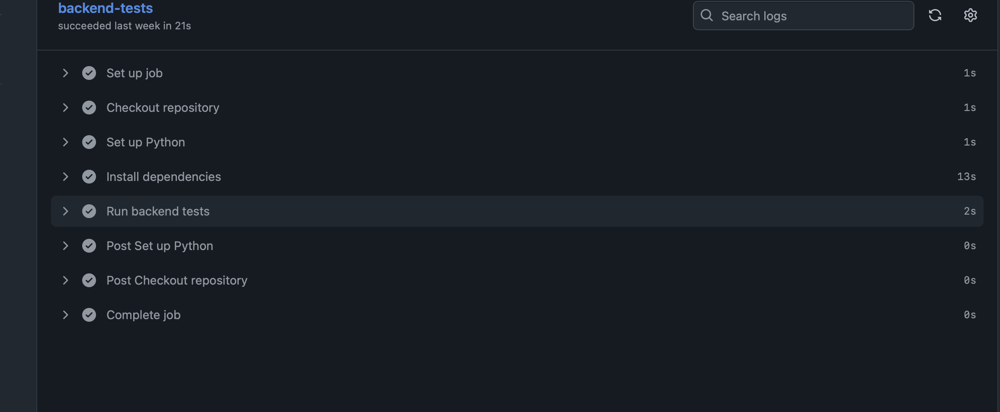
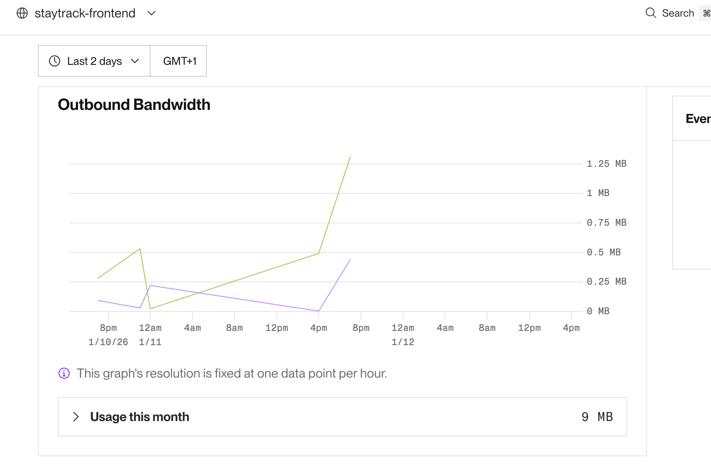
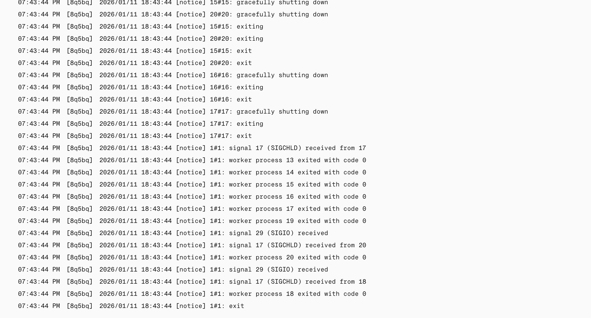

# 🚀 Hito 5: Despliegue en PaaS (Render) y Observabilidad

**Proyecto:** StayTrack – Despliegue y Monitorización en la Nube

---

## Índice
- [Introducción](#introducción)
- [Elección del PaaS: Render](#elección-del-paas-render)
- [Infraestructura como Código (IaC)](#infraestructura-como-código-iac-renderyaml)
- [Automatización del Despliegue](#automatización-del-despliegue)
- [Observabilidad y Monitorización](#observabilidad-y-monitorización)
- [Pruebas de Carga y Estrés](#pruebas-de-carga-y-estrés)
- [Conclusión](#conclusión)

---

## Introducción
El objetivo de este hito es llevar la arquitectura de microservicios desarrollada en los hitos anteriores a un entorno de producción en la nube. Se busca automatizar el despliegue, garantizar que la infraestructura sea reproducible y establecer mecanismos de monitorización para asegurar la fiabilidad del sistema.

### Enlaces a los Despliegues

A continuación se encuentran los enlaces a cada uno de los microservicios y aplicaciones desplegadas en Render:

*   **Frontend:** [https://staytrack-frontend-m4hf.onrender.com](https://staytrack-frontend-m4hf.onrender.com)
*   **API Gateway:** [https://staytrack-gateway.onrender.com](https://staytrack-gateway.onrender.com) ([Docs](https://staytrack-gateway.onrender.com/docs))
*   **Auth Service:** [https://auth-service-3bd9.onrender.com](https://auth-service-3bd9.onrender.com)
*   **User Service:** [https://user-service-ktj0.onrender.com](https://user-service-ktj0.onrender.com)
*   **Tracker Service:** [https://tracker-service-u5my.onrender.com](https://tracker-service-u5my.onrender.com)
*   **Goals Service:** [https://goals-service-2ldb.onrender.com](https://goals-service-2ldb.onrender.com)
*   **Stats Service:** [https://stats-service-oghh.onrender.com](https://stats-service-oghh.onrender.com)
*   **Catalog Service:** [https://catalog-service-hpez.onrender.com](https://catalog-service-hpez.onrender.com)

---

## Elección del PaaS: Render

Se ha seleccionado **Render** como plataforma de despliegue (PaaS).

### Justificación:
1.  **Infraestructura como Código (IaC):** Render permite definir toda la infraestructura (servicios web, bases de datos, workers) en un único archivo `render.yaml`. Esto cumple con el requisito de reproducibilidad sin depender de configuración manual en la consola web.
2.  **Integración con GitHub:** Despliegue automático (CD) al hacer push a la rama principal.
3.  **Región en Europa:** Render permite seleccionar la región `Frankfurt (EU Central)`, cumpliendo con la normativa de protección de datos y requisitos de la asignatura.
4.  **Soporte nativo para Docker:** Puede construir y desplegar directamente desde los `Dockerfile` de nuestros microservicios.
5.  **Capa Gratuita:** Ofrece servicios web y bases de datos PostgreSQL en su capa gratuita (o económica) suficientes para el MVP.

---

## Infraestructura como Código (IaC): `render.yaml`

La configuración completa del despliegue se encuentra en el archivo [`render.yaml`](../../render.yaml) en la raíz del repositorio. Este archivo "Blueprint" orquesta la creación de todos los recursos necesarios.

### Componentes definidos:

1.  **Base de Datos (PostgreSQL):**
    *   Servicio gestionado por Render.
    *   Persistencia de datos para los usuarios y registros.
    *   Variables de entorno autogeneradas para conexión segura (`DATABASE_URL`).

2.  **Microservicios (Web Services):**
    *   Se despliegan instancias individuales para cada servicio (`auth-service`, `user-service`, `tracker-service`, etc.).
    *   **Configuración:**
        *   `runtime: docker`: Usa los Dockerfiles existentes.
        *   `region: frankfurt`: Ubicación en Europa.
        *   `plan: free`: Nivel de servicio.
    *   **Variables de Entorno:** Se inyectan dinámicamente, conectando los servicios entre sí (por ejemplo, pasando la URL interna del `user-service` al `gateway`).

3.  **API Gateway:**
    *   Punto de entrada único público.
    *   Enruta el tráfico a los servicios internos (que pueden mantenerse privados en redes privadas de Render si se configura plan de pago, o públicos protegidos en plan gratuito).

**Ejemplo de configuración en `render.yaml`:**

```yaml
services:
  - type: web
    name: staytrack-gateway
    runtime: docker
    region: frankfurt
    rootDir: .
    dockerContext: .
    dockerfilePath: ./app/gateway/Dockerfile
    envVars:
      - key: AUTH_SERVICE_URL
        fromService:
          type: web
          name: auth-service
          property: url
```

---

## Automatización del Despliegue

La automatización se gestiona a través de **Render Blueprints**.

1.  **Conexión inicial:** Se vincula el repositorio de GitHub con Render y se selecciona el archivo `render.yaml`.
2.  **Sync Automático:** Render monitoriza la rama `main` (o la configurada). Al detectar un nuevo *commit* o *merge*, inicia automáticamente el proceso de construcción de las imágenes Docker y el redespliegue de los servicios afectados.
3.  **Rollbacks:** En caso de fallo en el despliegue, la plataforma permite volver a una versión anterior estable.



---

## Observabilidad y Monitorización

Para garantizar la resiliencia y detectar anomalías, se han implementado las siguientes estrategias:

### 1. Monitorización de Plataforma (Render Dashboard)
Render proporciona métricas nativas en tiempo real:
*   **Recursos:** Uso de CPU y Memoria RAM de cada contenedor.
*   **Despliegue:** Logs de construcción y estado del servicio (Live/Failed).
*   **Ancho de banda:** Tráfico de entrada/salida.



### 2. Logs Estructurados
Los microservicios emiten logs a `stdout`/`stderr` que son capturados por Render.
*   **Anomalías:** Permite rastrear errores 500 o fallos de conexión entre microservicios (como errores de DNS o timeouts).
*   **Trazas:** Al usar un Gateway, se pueden correlacionar peticiones observando los logs del Gateway y su servicio destino.



### 3. Monitorización de Disponibilidad (Uptime)
(Opcional: Se puede mencionar herramientas como UptimeRobot o health checks personalizados)
*   Se ha configurado un endpoint `/health` o `/root` que devuelve `200 OK`.
*   Herramientas externas pueden hacer ping a este endpoint para verificar que la aplicación es accesible desde internet.

---

## Pruebas de Carga y Estrés

Una vez desplegada la aplicación, se han realizado pruebas para verificar su comportamiento bajo carga.

**Herramientas sugeridas/usadas:** `Locust`.

**Ejemplo de prueba de carga:**
Se simulan 50 usuarios concurrentes accediendo al endpoint público del Gateway.

*   **Objetivo:** Verificar latencia media y tasa de errores.
*   **Resultado esperado:** El Gateway debe mantener tiempos de respuesta estables (<500ms) y no arrojar errores 5xx bajo carga moderada.

### Resultados de la Prueba (Locust)

Se ha ejecutado una prueba de estrés contra la aplicación desplegada en Render con los siguientes parámetros:
*   **Usuarios concurrentes:** 10
*   **Tasa de spawn:** 5 usuarios/segundo
*   **Duración:** 20 segundos
*   **Comando:** `locust --headless --users 10 --spawn-rate 5 -H https://staytrack-gateway.onrender.com --run-time 20s`

**Métricas obtenidas:**
```text
Type     Name      # reqs      # fails |    Avg     Min     Max    Med |   req/s  failures/s
--------||-------|-------------|-------|-------|-------|-------|--------|-----------
GET      /docs      183          0     |    220     230    870    230  |   ...
GET      /health     62          0     |    230     230    900    240  |   ...
--------||-------|-------------|-------|-------|-------|-------|--------|-----------
Aggregated          357          0     |    238     188    900    230  |   17.96     0.00
```

*   **Peticiones totales:** 357
*   **Latencia media:** 238ms
*   **Tasa de error:** 0% (Éxito total)
*   **Percentil 95%:** 280ms

Esto confirma que el despliegue es estable y responde rápidamente desde la ubicación de prueba.


---

## Conclusión

El Hito 5 completa el ciclo de vida del desarrollo software poniendo la aplicación a disposición de los usuarios finales.
*   ✅ **IaaS/PaaS:** Despliegue exitoso en Render (Europa).
*   ✅ **IaC:** Configuración reproducible con `render.yaml`.
*   ✅ **Automatización:** CI/CD integrado con GitHub.
*   ✅ **Observabilidad:** Monitorización activa de métricas y logs.

La infraestructura es ahora escalable y resiliente, lista para recibir tráfico real.
